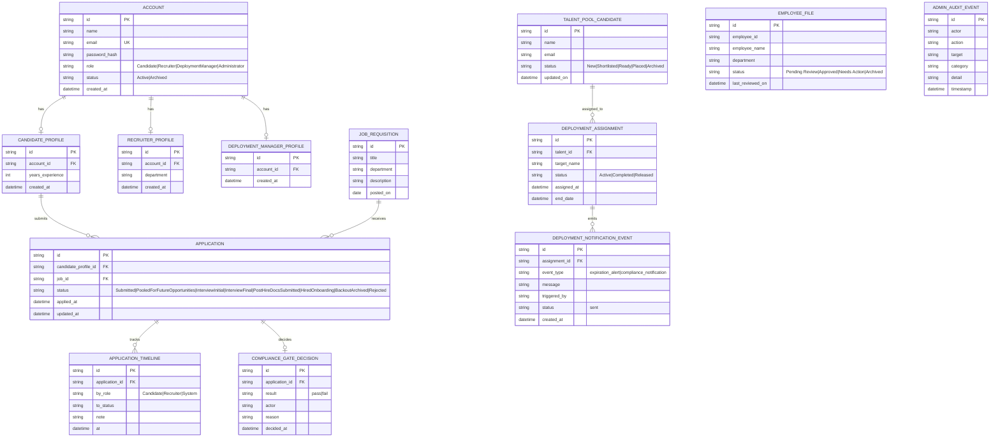

# ERD (Conceptual Data Model)

This app is currently React + localStorage mock state. The model below documents a backend-ready relational shape aligned to Processes 1.0–1.4.

## Mapping to current mock data
- `ACCOUNT`: `src/lib/mockAuthStore.js`
- `APPLICATION` and `JOB_REQUISITION`: `src/context/RecruitmentDataContext.jsx`, `src/lib/recruitmentMockData.js`
- `TALENT_POOL_CANDIDATE`: `src/context/TalentPoolContext.jsx`, `src/lib/talentPoolSchemas.js`
- `DEPLOYMENT_ASSIGNMENT`: `src/context/AdminWorkforceContext.jsx`, `src/lib/adminWorkforceMockData.js`
- `EMPLOYEE_FILE`: `src/context/DigitalFilesContext.jsx`, `src/lib/digitalFilesMockData.js`
- `ADMIN_AUDIT_EVENT`: `src/context/AdminDataContext.jsx`, `src/lib/adminMockData.js`

## Operational ownership (flowchart alignment)
- `Recruiter` (display label: `Talent Acquisition`) owns AI-ranked review, requisition alignment checks, talent-pool search/re-evaluation, analytics/audit reporting, and the 7-day compliance & interview gate.
- `DeploymentManager` owns active deployment monitoring, employee deployment status updates, Digital 201 vault operations, expiration alerts, and compliance notifications.
- `Administrator` owns staff account management, work-privilege assignment, recruitment & AI policy controls, usage history oversight, and system cleanup/data backup workflows.
