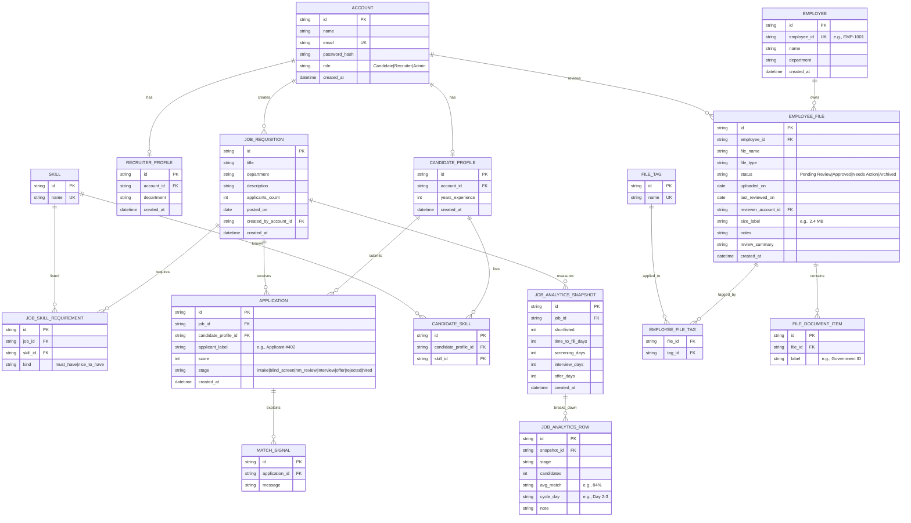

# ERD (Conceptual Data Model)

This project is currently a React-only UI with mock data stored in-memory / `localStorage` (see `src/lib/*MockData.js` and `src/lib/mockAuthStore.js`). This ERD documents a reasonable relational model you can use if/when you add a backend database.

**Mapping to current UI mock data**
- `ACCOUNT` comes from `src/lib/mockAuthStore.js` (currently plaintext passwords in `localStorage` for demo only).
- `JOB_REQUISITION`, `JOB_ANALYTICS_*`, and job-local candidate data comes from `src/lib/recruitmentMockData.js`.
- `EMPLOYEE` and `EMPLOYEE_FILE` come from `src/lib/digitalFilesMockData.js` (the “201 File” screens).

